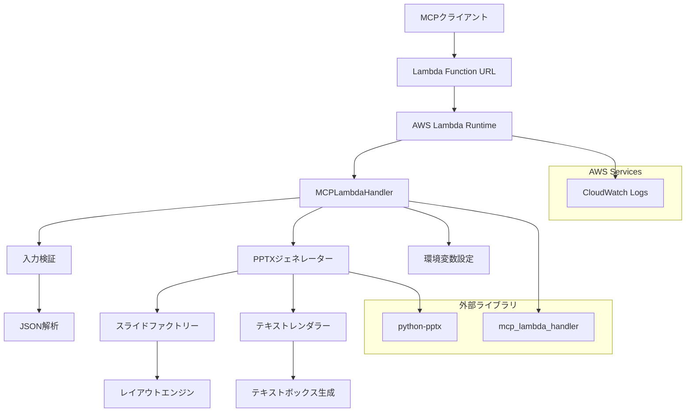
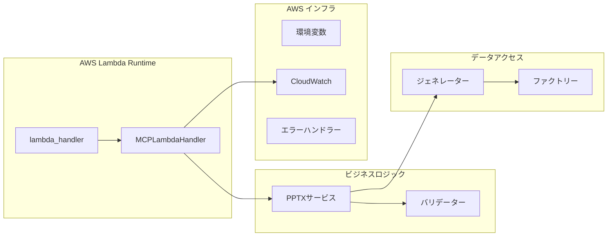
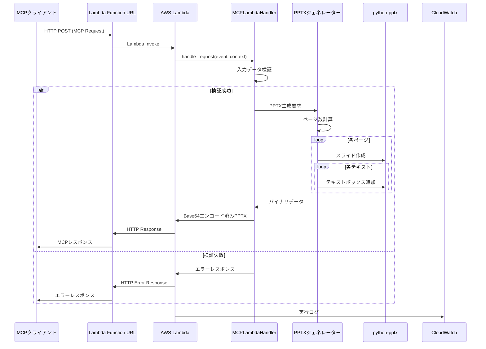
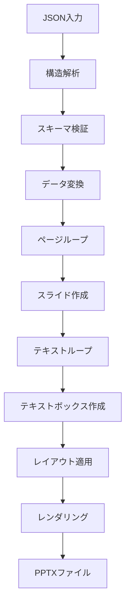

# pptx-textbox-mcp 技術設計書

## 1. 概要

本設計書は、複数ページ・複数テキストボックス対応のPowerPoint生成MCPサーバー「pptx-textbox-mcp」の技術仕様を定義します。

### 1.1 システム概要
- **目的**: JSON形式の構造化入力から複数スライドを持つPowerPointファイルを生成
- **入力形式**: `{page1:{text:["text1","text2",...]},page2:{...}...}`
- **出力**: ページごとに複数テキストボックスを含む.pptxファイル
- **実行環境**: AWS Lambda
- **プロトコル**: MCP (Model Context Protocol) v1.0準拠 (Lambda Function URL)
- **フレームワーク**: mcp_lambda_handler（AWS Lambda専用）

### 1.2 要件との対応関係
- **REQ 2.1**: mcp_lambda_handlerベースのAWS Lambda MCP実装
- **REQ 2.2**: 複数ページ対応のJSON入力処理
- **REQ 2.3**: ページごとの複数スライド・テキストボックス生成
- **REQ 2.4**: バイナリ.pptxファイル出力
- **REQ 2.5**: 包括的エラーハンドリング
- **REQ 2.6**: AWS Lambda環境変数による設定管理

## 2. アーキテクチャ設計

### 2.1 システムアーキテクチャ



### 2.2 コンポーネント構成



## 3. 技術スタック

### 3.1 コア技術

| 技術 | バージョン | 用途 | 選定理由 |
|------|-----------|------|----------|
| Python | 3.11+ | AWS Lambda Runtime | AWS Lambda対応・高性能 |
| mcp_lambda_handler | 最新 | AWS Lambda MCP | Lambda特化・サーバーレス対応 |
| python-pptx | 0.6.21+ | PowerPoint生成 | 成熟したライブラリ・豊富なAPI |
| AWS Lambda | - | 実行環境 | サーバーレス・自動スケーリング |
| uv | 最新 | パッケージ管理 | 高速依存解決・モダンツール |

### 3.2 開発・運用ツール

```python
# pyproject.toml 構成例
[project]
name = "pptx-textbox-mcp"
dependencies = [
    "awslabs-mcp-lambda-handler>=0.1.0",
    "python-pptx>=0.6.21",
    "pydantic>=2.0.0",
    "boto3>=1.26.0",
]
```

## 4. データフロー設計

### 4.1 リクエスト・レスポンスフロー



### 4.2 データ変換フロー



## 5. コンポーネント設計

### 5.1 Lambda ハンドラー

```python
from awslabs.mcp_lambda_handler import MCPLambdaHandler
from pydantic import BaseModel
from typing import Dict, List, Any, Optional
import json
import base64

class PPTXRequest(BaseModel):
    pages: Dict[str, Dict[str, List[str]]]
    template_config: Optional[Dict[str, Any]] = None

# MCPサーバーのインスタンス作成
mcp_server = MCPLambdaHandler(name="pptx-textbox-mcp", version="1.0.0")

@mcp_server.tool()
def create_pptx_from_text(pages: str) -> str:
    """
    複数ページのテキストからPPTXファイルを生成
    
    Args:
        pages: JSON文字列形式のページデータ {page1:{text:["text1","text2"]}, ...}
        
    Returns:
        Base64エンコードされたPPTXファイル
    """
    try:
        # JSON文字列をパース
        pages_data = json.loads(pages)
        request = PPTXRequest(pages=pages_data)
        
        # PPTX生成サービス呼び出し
        service = PPTXService()
        pptx_binary = service.generate_pptx(request)
        
        # Base64エンコードして返却
        return base64.b64encode(pptx_binary).decode('utf-8')
        
    except Exception as e:
        raise Exception(f"PPTX生成エラー: {str(e)}")

# AWS Lambdaエントリーポイント
def lambda_handler(event, context):
    """
    AWS Lambda handler function.
    """
    return mcp_server.handle_request(event, context)
```

### 5.2 PPTXサービス

```python
import os
import logging
from typing import Dict, Any

class PPTXService:
    def __init__(self):
        self.generator = PPTXGenerator()
        self.validator = InputValidator()
        # Lambda環境でのロガー設定
        self.logger = logging.getLogger()
        self.logger.setLevel(os.getenv('LOG_LEVEL', 'INFO'))
    
    def generate_pptx(self, request: PPTXRequest) -> bytes:
        """PPTX生成のメイン処理（同期処理）"""
        try:
            # 入力検証
            validated_data = self.validator.validate(request)
            
            # 環境変数から設定読み込み
            config = self._load_lambda_config()
            
            # PPTX生成
            pptx_data = self.generator.create_presentation(validated_data, config)
            
            self.logger.info(f"PPTX生成完了: {len(validated_data.pages)}ページ")
            return pptx_data
            
        except ValidationError as e:
            self.logger.error(f"入力検証エラー: {str(e)}")
            raise Exception(f"Invalid input: {e}")
        except Exception as e:
            self.logger.error(f"PPTX生成エラー: {str(e)}")
            raise Exception(f"Generation failed: {e}")
    
    def _load_lambda_config(self) -> Dict[str, Any]:
        """Lambda環境変数から設定読み込み"""
        return {
            'max_pages': int(os.getenv('MAX_PAGES', '50')),
            'max_text_boxes_per_page': int(os.getenv('MAX_TEXT_BOXES', '20')),
            'max_text_length': int(os.getenv('MAX_TEXT_LENGTH', '1000')),
            'default_font_size': int(os.getenv('DEFAULT_FONT_SIZE', '12')),
        }
```

### 5.3 PPTXジェネレーター

```python
from pptx import Presentation
from pptx.util import Inches
import io
from typing import Dict, Any, List

class PPTXGenerator:
    def __init__(self):
        self.layout_factory = LayoutFactory()
    
    def create_presentation(self, data: ValidatedData, config: Dict[str, Any]) -> bytes:
        """プレゼンテーション生成（同期処理）"""
        prs = Presentation()
        
        for page_name, page_data in data.pages.items():
            slide = self._create_slide(prs, page_name)
            self._add_text_boxes(slide, page_data.texts, config)
        
        return self._save_to_bytes(prs)
    
    def _create_slide(self, prs: Presentation, title: str):
        """スライド作成"""
        slide_layout = prs.slide_layouts[6]  # 白紙レイアウト
        slide = prs.slides.add_slide(slide_layout)
        return slide
    
    def _add_text_boxes(self, slide, texts: List[str], config: Dict[str, Any]):
        """テキストボックス配置"""
        layout = self.layout_factory.calculate_layout(len(texts))
        
        for i, text in enumerate(texts):
            position = layout.get_position(i)
            self._add_text_box(slide, text, position, config)
    
    def _add_text_box(self, slide, text: str, position, config: Dict[str, Any]):
        """個別テキストボックス追加"""
        textbox = slide.shapes.add_textbox(
            position.left, position.top, position.width, position.height
        )
        text_frame = textbox.text_frame
        text_frame.text = text
        
        # フォント設定
        paragraph = text_frame.paragraphs[0]
        font = paragraph.runs[0].font
        font.size = Pt(config.get('default_font_size', 12))
    
    def _save_to_bytes(self, prs: Presentation) -> bytes:
        """プレゼンテーションをバイト列に変換"""
        buffer = io.BytesIO()
        prs.save(buffer)
        buffer.seek(0)
        return buffer.read()
```

### 5.4 レイアウトファクトリー

```python
class LayoutFactory:
    def __init__(self, config: Config):
        self.config = config
    
    def calculate_layout(self, text_count: int) -> Layout:
        """テキスト数に基づく簡単なレイアウト計算"""
        # 白紙レイアウトでのシンプルな配置
        return SimpleVerticalLayout(text_count)

class Layout:
    def get_position(self, index: int) -> Position:
        """インデックスに基づく位置計算"""
        raise NotImplementedError

class Position:
    def __init__(self, left: float, top: float, width: float, height: float):
        self.left = Inches(left)
        self.top = Inches(top)
        self.width = Inches(width)
        self.height = Inches(height)
```

## 6. データモデル

### 6.1 入力データモデル

```python
class TextBoxConfig(BaseModel):
    font_size: Optional[int] = 12
    font_name: Optional[str] = "Arial"
    alignment: Optional[str] = "left"

class PageData(BaseModel):
    text: List[str]
    config: Optional[TextBoxConfig] = None

class PPTXInput(BaseModel):
    pages: Dict[str, PageData]
    template_config: Optional[Dict[str, Any]] = None
    
    @validator('pages')
    def validate_pages(cls, v):
        if not v:
            raise ValueError('少なくとも1ページが必要です')
        return v
    
    @validator('pages')
    def validate_text_content(cls, v):
        for page_name, page_data in v.items():
            if not page_data.text:
                raise ValueError(f'ページ "{page_name}" にテキストが必要です')
        return v
```

### 6.2 設定データモデル

```python
class ServerConfig(BaseModel):
    max_pages: int = 50
    max_text_boxes_per_page: int = 20
    max_text_length: int = 1000
    default_slide_width: float = 10.0
    default_slide_height: float = 7.5
    timeout_seconds: int = 30
    
class LayoutConfig(BaseModel):
    margin_inches: float = 0.5
    text_box_spacing: float = 0.2
    min_text_box_height: float = 0.5
    default_font_size: int = 12
```

## 7. エラーハンドリング

### 7.1 エラーカテゴリ

```python
class PPTXError(Exception):
    """PPTX生成関連のベースエラー"""
    pass

class ValidationError(PPTXError):
    """入力検証エラー"""
    def __init__(self, message: str, field: str = None):
        self.field = field
        super().__init__(message)

class GenerationError(PPTXError):
    """生成処理エラー"""
    pass

class ConfigurationError(PPTXError):
    """設定エラー"""
    pass
```

### 7.2 エラーハンドリング戦略

```python
class ErrorHandler:
    def __init__(self, logger):
        self.logger = logger
    
    async def handle_error(self, error: Exception) -> MCPError:
        """統一エラーハンドリング"""
        error_id = str(uuid.uuid4())
        
        if isinstance(error, ValidationError):
            self.logger.warning(
                "入力検証エラー",
                error_id=error_id,
                field=error.field,
                message=str(error)
            )
            return MCPError(
                code="VALIDATION_ERROR",
                message=f"入力データが無効です: {error}",
                data={"error_id": error_id, "field": error.field}
            )
        
        elif isinstance(error, GenerationError):
            self.logger.error(
                "生成エラー",
                error_id=error_id,
                message=str(error)
            )
            return MCPError(
                code="GENERATION_ERROR",
                message="PPTXファイルの生成に失敗しました",
                data={"error_id": error_id}
            )
        
        else:
            self.logger.error(
                "予期しないエラー",
                error_id=error_id,
                error_type=type(error).__name__,
                message=str(error)
            )
            return MCPError(
                code="INTERNAL_ERROR",
                message="内部エラーが発生しました",
                data={"error_id": error_id}
            )
```

## 8. セキュリティ考慮事項

### 8.1 入力検証

```python
class SecurityValidator:
    def __init__(self, config: ServerConfig):
        self.config = config
    
    def validate_input_limits(self, data: PPTXInput):
        """入力データの制限チェック"""
        # ページ数制限
        if len(data.pages) > self.config.max_pages:
            raise ValidationError(f"ページ数が上限({self.config.max_pages})を超過")
        
        # テキストボックス数制限
        for page_name, page_data in data.pages.items():
            if len(page_data.text) > self.config.max_text_boxes_per_page:
                raise ValidationError(
                    f"ページ '{page_name}' のテキストボックス数が上限を超過"
                )
        
        # テキスト長制限
        for page_name, page_data in data.pages.items():
            for i, text in enumerate(page_data.text):
                if len(text) > self.config.max_text_length:
                    raise ValidationError(
                        f"ページ '{page_name}' のテキスト{i+1}が長すぎます"
                    )
    
    def sanitize_text(self, text: str) -> str:
        """テキストのサニタイズ"""
        # 制御文字の除去
        sanitized = ''.join(char for char in text if ord(char) >= 32)
        # 長さ制限
        return sanitized[:self.config.max_text_length]
```

### 8.2 リソース管理

```python
class ResourceManager:
    def __init__(self, config: ServerConfig):
        self.max_memory_mb = config.max_memory_mb
        self.temp_dir = tempfile.mkdtemp()
    
    @contextmanager
    def memory_monitor(self):
        """メモリ使用量監視"""
        start_memory = psutil.Process().memory_info().rss
        try:
            yield
        finally:
            current_memory = psutil.Process().memory_info().rss
            memory_diff = (current_memory - start_memory) / 1024 / 1024
            if memory_diff > self.max_memory_mb:
                logger.warning(f"メモリ使用量が上限を超過: {memory_diff}MB")
    
    def cleanup(self):
        """リソースクリーンアップ"""
        shutil.rmtree(self.temp_dir, ignore_errors=True)
```

## 9. パフォーマンス設計

### 9.1 非同期処理

```python
class AsyncPPTXGenerator:
    def __init__(self, config: Config):
        self.config = config
        self.semaphore = asyncio.Semaphore(config.max_concurrent_requests)
    
    async def generate_pptx_async(self, request: PPTXRequest) -> str:
        """非同期PPTX生成"""
        async with self.semaphore:
            return await asyncio.get_event_loop().run_in_executor(
                None, self._generate_sync, request
            )
    
    def _generate_sync(self, request: PPTXRequest) -> str:
        """同期PPTX生成（別スレッドで実行）"""
        # python-pptxは同期ライブラリのためエグゼキューターで実行
        pass
```

### 9.2 キャッシュ戦略

```python
from functools import lru_cache
import hashlib

class TemplateCache:
    def __init__(self, max_size: int = 100):
        self.cache = {}
        self.max_size = max_size
    
    def get_template_hash(self, config: Dict) -> str:
        """テンプレート設定のハッシュ計算"""
        return hashlib.md5(
            json.dumps(config, sort_keys=True).encode()
        ).hexdigest()
    
    @lru_cache(maxsize=100)
    def get_layout(self, text_count: int, config_hash: str) -> Layout:
        """レイアウトキャッシュ"""
        return LayoutFactory.create_layout(text_count, config_hash)
```

### 9.3 メモリ最適化

```python
class MemoryOptimizer:
    @staticmethod
    def stream_pptx_generation(pages: Dict) -> Generator[bytes, None, None]:
        """ストリーミングPPTX生成"""
        # 大容量ファイル対応のためのストリーミング処理
        for page_chunk in chunk_pages(pages, chunk_size=10):
            yield generate_partial_pptx(page_chunk)
    
    @staticmethod
    def optimize_text_processing(texts: List[str]) -> List[str]:
        """テキスト処理最適化"""
        # 重複テキストの最適化
        seen = set()
        optimized = []
        for text in texts:
            if text not in seen:
                seen.add(text)
                optimized.append(text)
        return optimized
```

## 10. テスト戦略

### 10.1 テスト構造

```python
# tests/test_mcp_handler.py
class TestMCPHandler:
    async def test_create_pptx_tool_success(self):
        """正常系: PPTXツール呼び出し"""
        handler = MCPHandler(test_config)
        request = {
            "page1": {"text": ["テスト1", "テスト2"]},
            "page2": {"text": ["テスト3"]}
        }
        result = await handler.create_pptx_from_text(request)
        assert isinstance(result, str)
        assert len(result) > 0

# tests/test_generator.py
class TestPPTXGenerator:
    def test_single_page_generation(self):
        """単一ページ生成テスト"""
        generator = PPTXGenerator(test_config)
        data = create_test_data(pages=1, texts_per_page=2)
        result = generator.create_presentation(data)
        assert len(result) > 0
    
    def test_multiple_page_generation(self):
        """複数ページ生成テスト"""
        generator = PPTXGenerator(test_config)
        data = create_test_data(pages=5, texts_per_page=3)
        result = generator.create_presentation(data)
        
        # PPTXファイルの検証
        prs = load_pptx_from_bytes(result)
        assert len(prs.slides) == 5

# tests/test_performance.py
class TestPerformance:
    @pytest.mark.performance
    async def test_response_time_under_load(self):
        """負荷テスト: レスポンス時間"""
        start_time = time.time()
        
        tasks = []
        for _ in range(10):
            task = asyncio.create_task(
                generate_test_pptx(pages=10, texts_per_page=5)
            )
            tasks.append(task)
        
        await asyncio.gather(*tasks)
        
        end_time = time.time()
        assert (end_time - start_time) < 10  # 10秒以内
```

### 10.2 テストデータ生成

```python
class TestDataFactory:
    @staticmethod
    def create_test_pages(
        page_count: int, 
        texts_per_page: int,
        text_length: int = 50
    ) -> Dict[str, Dict[str, List[str]]]:
        """テストデータ生成"""
        pages = {}
        for i in range(page_count):
            page_name = f"page{i+1}"
            texts = [
                f"テストテキスト{j+1}: " + "a" * text_length 
                for j in range(texts_per_page)
            ]
            pages[page_name] = {"text": texts}
        return pages
    
    @staticmethod
    def create_edge_case_data() -> List[Dict]:
        """エッジケーステストデータ"""
        return [
            # 空ページ
            {"pages": {}},
            # 大量テキスト
            {"pages": {"page1": {"text": ["long_text" * 1000]}}},
            # 特殊文字
            {"pages": {"page1": {"text": ["🚀 特殊文字 テスト 💫"]}}},
            # 極小テキスト
            {"pages": {"page1": {"text": ["a"]}}},
        ]
```

### 10.3 統合テスト

```python
class TestIntegration:
    @pytest.mark.integration
    async def test_end_to_end_workflow(self):
        """エンドツーエンドテスト"""
        # 1. MCPサーバー起動
        server = await start_test_server()
        
        # 2. クライアント接続
        client = MCPClient(server.transport)
        
        # 3. ツール呼び出し
        response = await client.call_tool(
            "create_pptx_from_text",
            arguments=test_data
        )
        
        # 4. レスポンス検証
        assert response.isSuccess
        
        # 5. PPTXファイル検証
        pptx_data = base64.b64decode(response.content)
        assert is_valid_pptx(pptx_data)
        
        # 6. クリーンアップ
        await server.shutdown()
```

## 11. 設定管理

### 11.1 環境設定

```python
# config/settings.py
class Settings(BaseSettings):
    # サーバー設定
    host: str = "localhost"
    port: int = 8000
    debug: bool = False
    
    # パフォーマンス設定
    max_concurrent_requests: int = 10
    request_timeout: int = 30
    max_memory_mb: int = 50
    
    # PPTX設定
    max_pages: int = 50
    max_text_boxes_per_page: int = 20
    max_text_length: int = 1000
    
    # レイアウト設定
    default_slide_width: float = 10.0
    default_slide_height: float = 7.5
    margin_inches: float = 0.5
    
    class Config:
        env_file = ".env"
        env_prefix = "PPTX_MCP_"
```

### 11.2 設定バリデーション

```python
class ConfigValidator:
    @staticmethod
    def validate_settings(settings: Settings) -> Settings:
        """設定値の検証"""
        if settings.max_pages <= 0:
            raise ValueError("max_pages must be positive")
        
        if settings.max_text_length <= 0:
            raise ValueError("max_text_length must be positive")
        
        if settings.margin_inches < 0:
            raise ValueError("margin_inches must be non-negative")
        
        return settings
```

## 12. ログ・監視

### 12.1 構造化ログ

```python
import structlog

def configure_logging(debug: bool = False):
    """ログ設定"""
    structlog.configure(
        processors=[
            structlog.stdlib.filter_by_level,
            structlog.stdlib.add_logger_name,
            structlog.stdlib.add_log_level,
            structlog.stdlib.PositionalArgumentsFormatter(),
            structlog.processors.TimeStamper(fmt="iso"),
            structlog.processors.StackInfoRenderer(),
            structlog.processors.format_exc_info,
            structlog.processors.UnicodeDecoder(),
            structlog.processors.JSONRenderer() if not debug else structlog.dev.ConsoleRenderer()
        ],
        context_class=dict,
        logger_factory=structlog.stdlib.LoggerFactory(),
        wrapper_class=structlog.stdlib.BoundLogger,
        cache_logger_on_first_use=True,
    )

class RequestLogger:
    def __init__(self):
        self.logger = structlog.get_logger()
    
    async def log_request(self, request_id: str, request_data: dict):
        """リクエストログ"""
        self.logger.info(
            "PPTXリクエスト開始",
            request_id=request_id,
            page_count=len(request_data.get("pages", {})),
            total_text_boxes=sum(
                len(page.get("text", [])) 
                for page in request_data.get("pages", {}).values()
            )
        )
    
    async def log_response(self, request_id: str, success: bool, duration: float):
        """レスポンスログ"""
        self.logger.info(
            "PPTXリクエスト完了",
            request_id=request_id,
            success=success,
            duration_ms=duration * 1000
        )
```

### 12.2 パフォーマンス監視

```python
class PerformanceMonitor:
    def __init__(self):
        self.metrics = {
            "request_count": 0,
            "success_count": 0,
            "error_count": 0,
            "total_duration": 0.0,
        }
    
    @contextmanager
    def measure_request(self, request_id: str):
        """リクエスト計測"""
        start_time = time.time()
        self.metrics["request_count"] += 1
        
        try:
            yield
            self.metrics["success_count"] += 1
        except Exception:
            self.metrics["error_count"] += 1
            raise
        finally:
            duration = time.time() - start_time
            self.metrics["total_duration"] += duration
            
            structlog.get_logger().info(
                "リクエスト計測",
                request_id=request_id,
                duration=duration,
                avg_duration=self.metrics["total_duration"] / self.metrics["request_count"]
            )
```